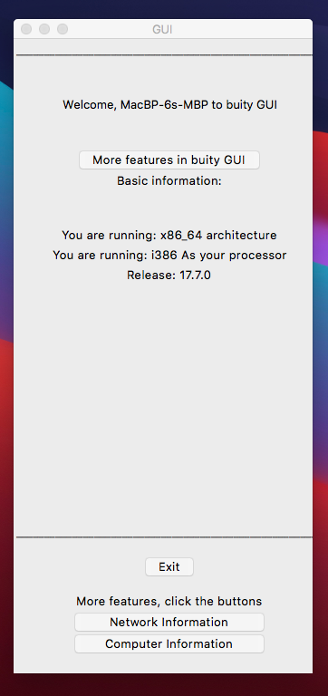

# ComputerSpecificationViewer.py
Buity GUI Computer Specification viewer written in python, using the tkinter gui moduel.

Clone
```
git clone https://github.com/CollinEdward/ComputerSpecificationViewer.py.git
```

